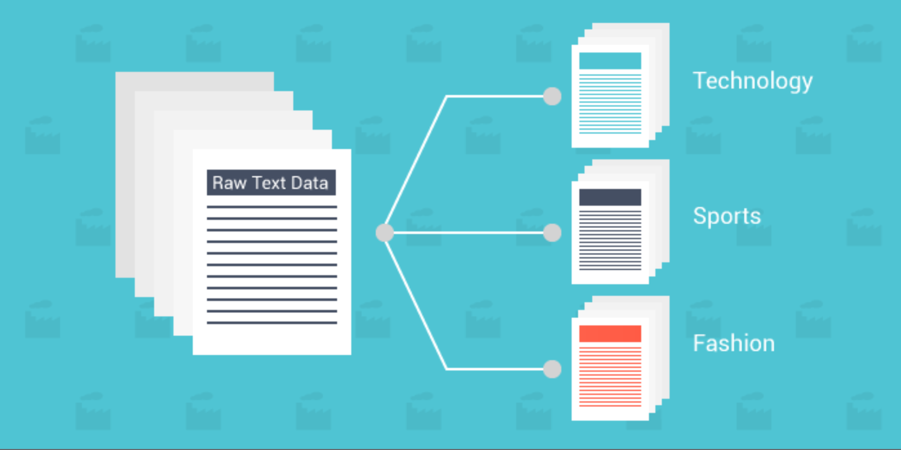
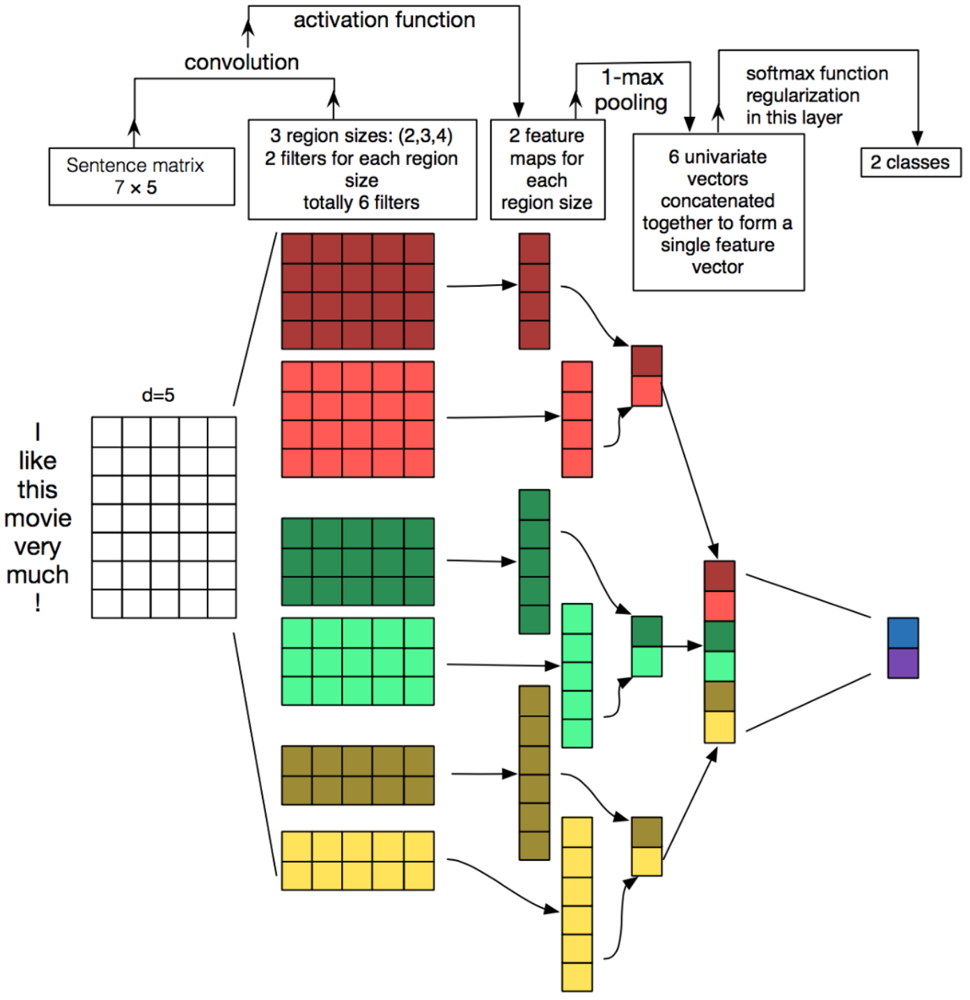

# Document Classifier

The study of natural language processing has been around for more than 50 years and grew out of the field of linguistics with the rise of computers. Recently, more and more employers are looking for data scientists who are knowledgeable in the field and want to utilize the power of information hidden in the vast literature regarding every possible topic a human mind can conceive. Natural Language Processing poses some exciting opportunities across various industries through analysis of the vast amount of data in order to deliver a better quality of service. Use cases can be found in neural machine translation, sentiment analysis, HR and recruiting, advertising and healthcare.
Document classification is an example of Machine Learning (ML) in the form of Natural Language Processing (NLP). By classifying text, we are aiming to assign one or more classes or categories to a document, making it easier to manage and sort. This is especially useful for publishers, news sites, blogs or anyone who deals with a lot of content. In our case, we have a dataset consisted of articles published by BBC, each one categorized in one of the four groups: business, politics, entertainment and sports. Thus, our goal is to create a classifier which we will feed with a text and will be able to put it under one of these labels. So, practically, we are dealing with a multilabel classification.

### Deep Learning for Natural Language Processing

There is a lot of hype and large claims around deep learning methods, but beyond the hype, deep learning methods are achieving state-of-the-art results on challenging problems. Notably in natural language processing. Taking that into consideration, our efforts will be based on neural network solutions. Specifically, we will create two different classifiers: one based on a Convolutional Neural Network (CNN) and another based on based on Bidirectional Recurrent Neural Network (BRNN).

### CNN-based Document Classifier:

When we use a CNN on text data through a diagram, the result of each convolution will fire when a special pattern is detected. By varying the size of the kernels and concatenating their outputs, we are allowing ourselves to detect patterns of multiples sizes. Common expressions can be perceived by the CNN as "patterns" and therefore, CNN is able to capture them irrespective of their position in the sentence.

### BRNN-based Document Classifier:

RNN is a sequence of neural network blocks that are linked to each other’s like a chain. Each one is passing a message to a successor. Although they’re complex to understand, they’re quite interesting. They encapsulate a design that overcomes traditional neural networks’ shortcomings that arise when dealing with sequence data: text, time series, videos, DNA sequences, etc.

BRNN's connect two hidden layers of opposite directions to the same output. With this form of generative deep learning, the output layer can get information from past (backwards) and future (forward) states simultaneously. They were introduced to increase the amount of input information available to the network.

### Word embeddings - GloVe

Word embedding is the collective name for a set of language modeling and feature learning techniques in natural language processing (NLP) where words or phrases from the vocabulary are mapped to vectors of real numbers. Conceptually it involves a mathematical embedding from a space with many dimensions per word to a continuous vector space with a much lower dimension. 

Using the knowledge from an external embedding can enhance the precision of your RNN because it integrates new information (lexical and semantic) about the words, an information that has been trained and distilled on a very large corpus of data. The pre-trained embedding we’ll be using is Global Vectors or GloVe. GloVe is an unsupervised learning algorithm for obtaining vector representations for words. Training is performed on aggregated global word-word co-occurrence statistics from a corpus, and the resulting representations showcase interesting linear substructures of the word vector space. 

Some more information and links are provided in the [Jupyter Notebook](https://github.com/giorgosterz/Document_CLassifier---NLP/blob/master/document_classifier_bbc_news.ipynb), so let's jump right in!

*Sources*: 
- *https://en.wikipedia.org/wiki/Document_classification* 
- *https://en.wikipedia.org/wiki/Natural_language_processing*
- *https://en.wikipedia.org/wiki/Bidirectional_recurrent_neural_networks*
- *https://en.wikipedia.org/wiki/Word_embedding*
- *https://nlp.stanford.edu/projects/glove/*
